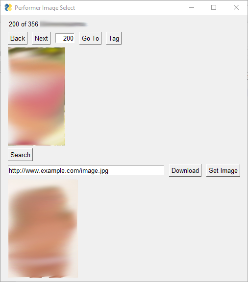

# Performer Image Search Plugin

A stash plugin for opening a google image search of performer names in your browser and updating performer images

Searching for performer images and updating them in Stash can be a repetitive and time consuming task. You have to google image search a performer name, find an image, go to the performer's Stash page, click Set Image -> From URL, copy paste the image url, and then click save.

Repeat that process for dozens or hundreds of performers and that's a lot of repetitive clicks, typing, scrolling, and copy-pasting.

This plugin provides a GUI to simplify this task, so you can google image search for performer images and update stash more efficiently.

## Usage

The current performer image is shown on top. Click `Search` and a new browser window/tab will pop up going to a google image search of the term `<performer name> porn`. Copy/paste the url of the image you want to use into the text box at the bottom and then click `Download`. If the image is successfully downloaded, it will show up at the bottom. Then click `Set Image` to update stash to use this performer image.

*Note: Sometimes it will fail to download certain image urls. If a download fails, it will show up in the logs and you won't see the image in the GUI. In that case, you'll just have to download and update the image in stash the normal way*

## Requirements

Python 3.6+

## Installation

Put `performer_image_search` into your `plugins` directory

Run `pip install -r requirements.txt` in the `performer_image_search` folder

## Configuration

* `BROWSER_PATH`
  Set this to the path to your browser executable

* `BROWSER_PRIVATE_FLAG`
  Set this to the private window command line switch for the browser you use. The settings for Chromium, Firefox, and Edge browsers are provided, just uncomment (remove the leading #) the one that corresponds to your browser and remove the other lines.

### Options

* `TAG_PERFORMERS`
  Applies a tag to the performer if an image is selected. *Note: The tag will also be applied if `skip` is used*

* `SHOW_UNTAGGED_ONLY`
  Whether or not to show untagged performers

* `TAG_NAME`
  Name of tag to use if `TAG_PERFORMERS = True` *Note: tag will be created if it does not exist*

## Hotkeys

* Previous Performer `A`, `Left Arrow`
* Next Performer `D`, `Right Arrow`
* Search `S`
